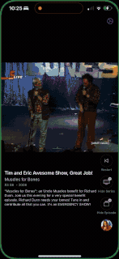

# Surf for Plex

  

## 🏄‍♂️ What is Surf for Plex?

**TikTok meets Plex.** Surf for Plex brings the vertical video browsing experience to your personal media library. Jump into random moments from random videos in your Plex collection and discover content you forgot you had.

## ✨ Features

### ↕️ Intuitive Swiping
- **Swipe up** for the next random video
- **Swipe down** to go back to the previous video

### 📺 Custom Content Selection
- Choose specific shows/episodes

## 🤔 FAQ

### Will there be an Android version?
Not currently planned, but if there's enough interest, we might consider it in the future. Let us know by starring this repo!

### How much will it cost?
Still figuring that out. You know, gotta feed the monkey...

### It doesn't work with my Plex server!
We're not surprised! I have a pretty basic Plex setup and there are countless server configurations out there. Please:

1. File an issue with details about your setup
2. Use the in-app log export feature to send diagnostic logs
3. Be patient - learning as I go!

## 🚀 Join the Beta!

Surf for Plex is currently in beta testing via TestFlight. You can join the beta and help us test by visiting:

👉 [Join the TestFlight Beta](https://testflight.apple.com/join/YMmP1TKZ)

## 📝 Contributing

Found a bug? Have a feature request? Please open an issue! We're especially interested in hearing about:

- Different Plex server configurations
- Content types that aren't working properly
- UI/UX improvements
